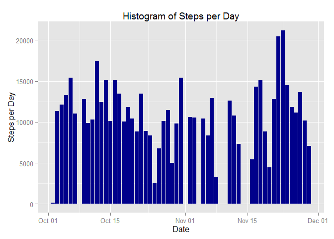
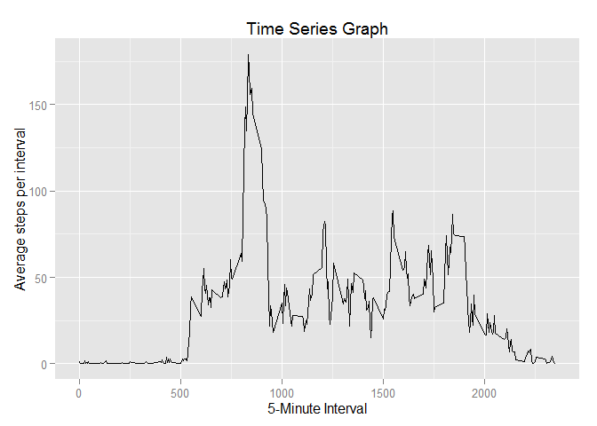
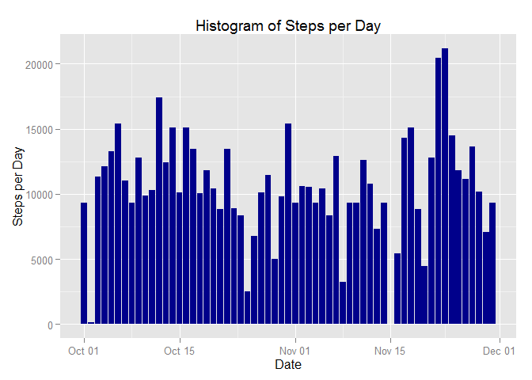
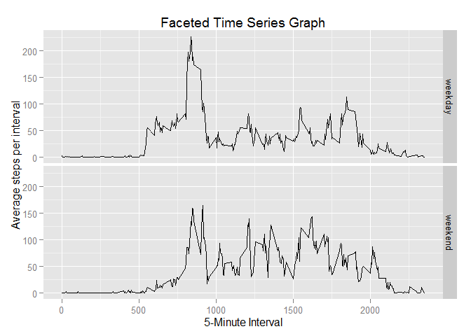

# Reproducible Research: Peer Assessment 1
Jonathan Hill

## Loading necessary R packages

```r
library(dplyr)
```

```
## 
## Attaching package: 'dplyr'
## 
## The following object is masked from 'package:stats':
## 
##     filter
## 
## The following objects are masked from 'package:base':
## 
##     intersect, setdiff, setequal, union
```

```r
library(ggplot2)
```

```
## Warning: package 'ggplot2' was built under R version 3.1.3
```

## Loading and preprocessing the data

I'll name my dataset "activity" and convert the date variable from a factor to a date.


```r
activity <- read.csv("activity.csv",header=TRUE)
activity$date <- as.Date(activity$date)
```

Then process the data so that it is summarized by the day and calculate the mean and median.


```r
activityDay <- activity %>%
        group_by(date) %>%
        summarize (stepsDay = sum(steps)
                   )
meanstepsperday <- mean(activityDay$stepsDay,na.rm=TRUE)
medianstepsperday <- median(activityDay$stepsDay,na.rm=TRUE)
```

## What is mean total number of steps taken per day?

The mean total number of steps taken per day is 1.0766189\times 10^{4} and the median is 10765.

### Histogram of steps per day


```r
ggplot(data=activityDay,mapping = aes(date,stepsDay))+
        geom_bar(stat="identity", fill ="dark blue")+
        labs(y="Steps per Day", x="Date", title="Histogram of Steps per Day")
```

```
## Warning: Removed 8 rows containing missing values (position_stack).
```

 

## What is the average daily activity pattern?

First I will reshape the data and summarize it by the day. 


```r
activityInt <- activity %>%
        group_by(interval) %>%
        summarize (stepsInt = sum(steps, na.rm=TRUE)/61
        )
```

Then graph it here:

```r
ggplot(data =activityInt,mapping=aes(interval,stepsInt))+
        geom_line()+
        labs(y="Average steps per interval",x="5-Minute Interval",title="Time Series Graph")
```

 

Next, I calculate the 5-minute interval in which the maximum number of steps are taken.

```r
maxInt <- activityInt$interval[which.max(x = activityInt$stepsInt)]
```

The 5-minute interval in which the maximum average steps are taken is 835.

## Imputing missing values

```r
missingval <- sum(is.na(activity$steps))
```

The dataset has 2304 missing values. Therfore, I will merge it with the dataset from the average daily activity pattern above.  Then I will use an ifelse statement to replace the missing values with the average number of steps in a given 5-minute interval.

```r
mergedactivity <- merge(activityInt,activity,by="interval")
mergedactivity$steps <- ifelse(is.na(mergedactivity$steps),
                         mergedactivity$stepsInt,
                         mergedactivity$steps)
```

Finally, in order to bring the data back to its original state, I drop the average calculation variable.

```r
mergedactivity$stepsInt <- NULL
```

Here is the new histogram.

```r
cleanhist <- mergedactivity %>%
        group_by(date) %>%
        summarize (stepsDay = sum(steps)
        )

ggplot(data=cleanhist,mapping = aes(date,stepsDay))+
        geom_bar(stat="identity", fill ="dark blue")+
        labs(y="Steps per Day", x="Date", title="Histogram of Steps per Day")
```

 

```r
cleanmean <- mean(cleanhist$stepsDay)
cleanmedian <- median(cleanhist$stepsDay)
```

The new mean is 1.0581014\times 10^{4} and the new median is 1.0395\times 10^{4}.  By imputing the missing values, the mean decreases by 185.1749733 and the median decreases by 370.

## Are there differences in activity patterns between weekdays and weekends?

Creating a new factor variable to indicate weekend or weekday:

```r
mergedactivity$dow <- weekdays(mergedactivity$date)
mergedactivity$weekend <- ifelse(mergedactivity$dow == "Saturday","weekend",ifelse(mergedactivity$dow == "Sunday","weekend","weekday"))
mergedactivity$weekend <- as.factor(mergedactivity$weekend)
```

Manipulating the data

```r
cleanInt <- mergedactivity %>%
        group_by(interval,weekend) %>%
        summarize (stepsInt = mean(steps, na.rm=TRUE)
        )
```

Creating the faceted line graphs

```r
ggplot(data =cleanInt,mapping=aes(interval,stepsInt))+
        geom_line()+
        facet_grid(weekend~.)+
        labs(y="Average steps per interval",x="5-Minute Interval",title="Faceted Time Series Graph")
```

 
